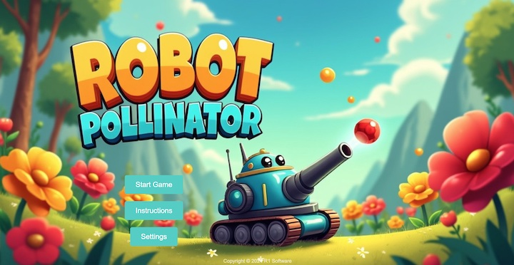

# Robot Pollinator Game

Robot Pollinator Game is a fun and educational web-based SPA game where players control a robot pollinator to help pollinate flowers and earn points. The game is designed to teach about the importance of pollination in a fun and interactive way.
It was inspired by an (extremely cool! ) Arduino hardware project designed by my friend Fernando Mercado Fuertes and his niece for a school project.

## How to Play

1. **Score Points:** Match the pollen color to the female flower color to earn 100 points. Wrong color matches will deduct 100 points.
2. **Win Condition:** Reach 1000 points within 3 minutes to win the game.

## Game Settings

The game offers various settings to customize the gameplay experience:

- **Game Speed:** Set the speed of the robot 1 (slowest) - 5 (fastest).
- **Game Duration (seconds):** Set the duration of the game in seconds.
- **Points to Win:** Adjust the target score required to win the game.
- **Points per Match:** Change the number of points awarded for a correct pollen match.
- **Penalty Points:** Set the number of points deducted for an incorrect pollen match.
- **Action Buttons:** (Mobile only) Set the Fire/Switch buttons left/right hand play.
- **Background Music:** Change the background music during gameplay.
- **Win Sound:** Change the sound effect played upon winning the game.
- **Game Over Sound:** Change the sound effect played when the game is over.
- **Game Background:** Change the background image for the gameplay area.
- **Title Screen Background:** Changethe background image for the title screen.

## Controls

On Desktop:
- **Pause/Resume Game:** Press 'P'.
- **Quit Game:** Press 'Q', then click 'YES/NO' on the confirmation prompt.
- **Move Robot Pollinator:** Move the mouse cursor, and aim the canon.
- **Collect Pollen:** Approach male flowers.
- **Shoot Pollen:** Mouse Left-click.
- **Switch Pollen Colors:** Mouse Right-click.

On Mobile:
- **Pause/Resume Game:** Tap the PAUSE icon, resume with the Play icon
- **Quit Game:** Tap EXIT icon, then click 'YES/NO' on the confirmation prompt.
- **Move Robot Pollinator:** Tap on the game area to move and aim the canon.
- **Collect Pollen:** Approach male flowers.
- **Shoot Pollen:** Tap the FIRE icon.
- **Switch Pollen Colors:** Tap the SWITCH icon.

## Getting Started

To run the Robot Pollinator Game locally, follow these steps:

1. Clone the repository: `git clone https://github.com/lfontanez/robot-pollinator-game.git`
2. Navigate to the project directory: `cd robot-pollinator-game`
3. Open the `index.html` file in a web browser.

## Contributing

Contributions to the Robot Pollinator Game are welcome! If you find any issues or have suggestions for improvements, please open an issue or submit a pull request.

## License

This project is licensed under the [MIT License](LICENSE).

## Credits

The Robot Pollinator Game was developed by Leamsi Fontánez - R1Software.com as an educational resource to teach about pollination in a fun and engaging way.
Websim.ai, Flux PRO 1.1 for title screen, audio clips and background were borrowed from royalty free sources to develop the game.